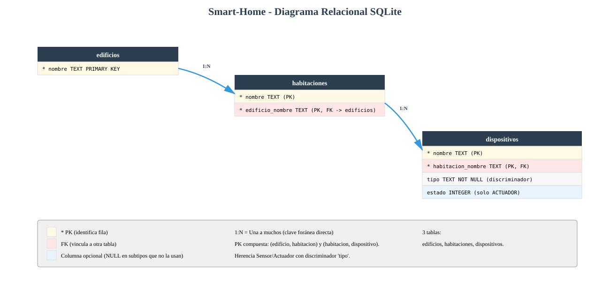

# Diseño de tablas SQLite para Smart-Home

Este documento te guía paso a paso para transformar tu proyecto de almacenamiento en memoria (diccionarios y listas de Python) a una **base de datos SQLite persistente**. El objetivo es que entiendas qué tablas necesitas crear, por qué están diseñadas así y cómo escribir el SQL.

Como referencia, puedes consultar cómo se hizo esta misma transición en el proyecto modelo de la expendedora (`modelo/cepy_pd4/proyecto/04-sqlite/expendedora/`).


## Fase 1: Identificar las entidades y sus atributos

**Edificio** (`domain/entities/edificio.py`)

| Atributo | Tipo en Python | Tipo en SQL | Notas |
|---|---|---|---|
| `nombre` | str | TEXT | Nombre del edificio (clave natural) |

**Habitacion** (`domain/entities/habitacion.py`)

| Atributo | Tipo en Python | Tipo en SQL | Notas |
|---|---|---|---|
| `nombre` | str | TEXT | Nombre de la habitación (clave natural) |

**Dispositivo** (`domain/entities/dispositivo.py`) — Clase base

| Atributo | Tipo en Python | Tipo en SQL | Notas |
|---|---|---|---|
| `nombre` | str | TEXT | Nombre del dispositivo |
| (discriminador) | — | TEXT | Columna `tipo` para distinguir el subtipo: SENSOR, ACTUADOR |
| `estado` | bool | INTEGER | Solo para Actuador (NULL en Sensor); 1 si activo, 0 si no |

**Sensor** — Hereda de Dispositivo (sin atributos adicionales)

**Actuador** — Hereda de Dispositivo
- Añade `estado` (booleano)


## Fase 2: Conceptos básicos de bases de datos

### Tabla, fila y columna

Una **tabla** es como un diccionario de Python, pero guardado en disco:
- Cada **fila** es un objeto individual (un edificio, una habitación, un dispositivo)
- Cada **columna** es un atributo de ese objeto

**Ejemplo:**
```
Tabla: dispositivos
┌───────────────────┬──────────────┬──────────┬────────┐
│ nombre            │ habitacion   │ tipo     │ estado │
├───────────────────┼──────────────┼──────────┼────────┤
│ SensorDormitorio  │ Dormitorio   │ SENSOR   │ NULL   │
│ ActuadorDormitorio│ Dormitorio   │ ACTUADOR │ 0      │
│ SensorSalon       │ Salón        │ SENSOR   │ NULL   │
│ ActuadorSalon     │ Salón        │ ACTUADOR │ 0      │
└───────────────────┴──────────────┴──────────┴────────┘
```

### Clave primaria (PRIMARY KEY)

Es la columna que **identifica de forma única cada fila**. En tu código:
- Para edificios → `nombre` es la clave primaria
- Para habitaciones → el par `(edificio_nombre, nombre)` es la clave primaria compuesta: dos edificios distintos podrían tener una habitación "Salón", pero dentro del mismo edificio el nombre de habitación debe ser único
- Para dispositivos → el par `(habitacion_nombre, nombre)` es la clave primaria compuesta

### Clave foránea (FOREIGN KEY)

Es una columna que "apunta" a la clave primaria de **otra tabla**. Sirve para crear vínculos entre tablas y garantiza que sean válidos.

**Ejemplo:** Una habitación tiene un `edificio_nombre` que apunta a la clave primaria `nombre` de la tabla `edificios`. Si intentas guardar una habitación con un edificio que no existe, la base de datos lo rechazará automáticamente.

En SQLite esto se activa con `PRAGMA foreign_keys = ON` al inicio de cada conexión.

### Relaciones entre tablas

- **Uno a muchos (1:N):** muy común.
  - Ejemplo en tu proyecto: un **edificio** contiene muchas **habitaciones**. El edificio "Mi Casa Inteligente" tiene las habitaciones "Dormitorio" y "Salón".
  - Otro ejemplo: una **habitación** contiene muchos **dispositivos**.

- **Muchos a muchos (N:M):** Requiere tabla intermedia. En tu proyecto **NO hay relaciones N:M**.


## Fase 3: Identificar las relaciones entre entidades

### Relaciones uno a muchos (1:N)

**Un edificio contiene muchas habitaciones**
- Cada habitación pertenece a un único edificio
- Columna `edificio_nombre` en la tabla `habitaciones` como FK a `edificios(nombre)`

**Una habitación contiene muchos dispositivos**
- Cada dispositivo pertenece a una única habitación
- Columna `habitacion_nombre` en la tabla `dispositivos` como FK a `habitaciones(nombre)`

### Herencia en el dominio

`Sensor` y `Actuador` heredan de `Dispositivo`. En SQL, usamos:

**Tabla única con discriminador** (la opción elegida)
- Una sola tabla `dispositivos` con columna `tipo` ('SENSOR', 'ACTUADOR')
- Los atributos específicos (`estado`) se incluyen como columnas que aceptan NULL
- Más simple que dividir en varias tablas
- Evita uniones (joins) complicadas al recuperar un dispositivo


## Fase 4: Diseño de las tablas

### Tabla `edificios`

| Columna | Tipo | Notas |
|---|---|---|
| `nombre` | TEXT | Clave primaria (ej: "Mi Casa Inteligente") |


### Tabla `habitaciones`

| Columna | Tipo | Notas |
|---|---|---|
| `nombre` | TEXT | Parte de la clave primaria compuesta |
| `edificio_nombre` | TEXT | Clave foránea → `edificios(nombre)` (parte de PK) |

**¿Por qué PK compuesta (edificio_nombre, nombre)?** Porque dos edificios distintos podrían tener una habitación con el mismo nombre (ambos pueden tener "Salón"). La combinación es lo que identifica de forma única una fila.


### Tabla `dispositivos`

Almacena todos los dispositivos (tanto sensores como actuadores) en una única tabla con columna discriminadora.

| Columna | Tipo | Notas |
|---|---|---|
| `nombre` | TEXT | Parte de la clave primaria compuesta |
| `habitacion_nombre` | TEXT | Clave foránea → `habitaciones(nombre)` (parte de PK) |
| `tipo` | TEXT | Discriminador: 'SENSOR' o 'ACTUADOR' (NOT NULL) |
| `estado` | INTEGER | Solo para Actuador (NULL en Sensor); 1 o 0 |

**¿Por qué `tipo` es necesario?** Aunque `Sensor` y `Actuador` heredan de `Dispositivo`, en SQL usamos una sola tabla. La columna `tipo` indica el subtipo, para reconstruir el objeto correcto al recuperarlo.

### Diagrama relacional resultante



Las 3 tablas del sistema:
- **edificios → habitaciones** (1:N): un edificio contiene muchas habitaciones
- **habitaciones → dispositivos** (1:N): una habitación contiene muchos dispositivos (sensores y actuadores)


## Fase 5: SQL de creación

```sql
PRAGMA foreign_keys = ON;

-- 1. Tabla de edificios (no depende de otras)
CREATE TABLE IF NOT EXISTS edificios (
    nombre TEXT PRIMARY KEY
);

-- 2. Tabla de habitaciones (depende de edificios)
CREATE TABLE IF NOT EXISTS habitaciones (
    nombre TEXT NOT NULL,
    edificio_nombre TEXT NOT NULL,
    PRIMARY KEY (edificio_nombre, nombre),
    FOREIGN KEY (edificio_nombre) REFERENCES edificios(nombre)
);

-- 3. Tabla de dispositivos (depende de habitaciones)
CREATE TABLE IF NOT EXISTS dispositivos (
    nombre TEXT NOT NULL,
    habitacion_nombre TEXT NOT NULL,
    tipo TEXT NOT NULL,
    estado INTEGER,
    PRIMARY KEY (habitacion_nombre, nombre),
    FOREIGN KEY (habitacion_nombre) REFERENCES habitaciones(nombre)
);
```


## Fase 6: Script de ejemplo para crear la base de datos

```python
"""Script para crear la base de datos de Smart-Home con datos iniciales."""

import sqlite3
from pathlib import Path

ruta_bd = Path("smarthome.db")
if ruta_bd.exists():
    ruta_bd.unlink()

conn = sqlite3.connect(ruta_bd)
cursor = conn.cursor()
cursor.execute("PRAGMA foreign_keys = ON")

cursor.executescript("""
PRAGMA foreign_keys = ON;

CREATE TABLE IF NOT EXISTS edificios (
    nombre TEXT PRIMARY KEY
);

CREATE TABLE IF NOT EXISTS habitaciones (
    nombre TEXT NOT NULL,
    edificio_nombre TEXT NOT NULL,
    PRIMARY KEY (edificio_nombre, nombre),
    FOREIGN KEY (edificio_nombre) REFERENCES edificios(nombre)
);

CREATE TABLE IF NOT EXISTS dispositivos (
    nombre TEXT NOT NULL,
    habitacion_nombre TEXT NOT NULL,
    tipo TEXT NOT NULL,
    estado INTEGER,
    PRIMARY KEY (habitacion_nombre, nombre),
    FOREIGN KEY (habitacion_nombre) REFERENCES habitaciones(nombre)
);
""")

# Datos iniciales (coinciden con tu EdificioRepositoryMemory._cargar_datos_iniciales())

# Edificio
cursor.execute("INSERT INTO edificios (nombre) VALUES ('Mi Casa Inteligente')")

# Habitaciones
cursor.executemany(
    "INSERT INTO habitaciones (nombre, edificio_nombre) VALUES (?, ?)",
    [
        ("Dormitorio", "Mi Casa Inteligente"),
        ("Salón",      "Mi Casa Inteligente"),
    ],
)

# Dispositivos
cursor.executemany(
    """INSERT INTO dispositivos (nombre, habitacion_nombre, tipo, estado)
       VALUES (?, ?, ?, ?)""",
    [
        ("SensorDormitorio",   "Dormitorio", "SENSOR",   None),
        ("ActuadorDormitorio", "Dormitorio", "ACTUADOR", 0),
        ("SensorSalon",        "Salón",      "SENSOR",   None),
        ("ActuadorSalon",      "Salón",      "ACTUADOR", 0),
    ],
)

conn.commit()
conn.close()

print("Base de datos creada en: smarthome.db")
```

**Características importantes:**
- Elimina la BD existente para recrearla limpia (idempotente)
- Crea las tablas en el orden correcto respetando claves foráneas
- Activa integridad referencial con `PRAGMA foreign_keys = ON`
- Inserta los mismos datos iniciales que tu repositorio en memoria (1 edificio, 2 habitaciones, 4 dispositivos)


## Fase 7: Ejemplo de implementación del repositorio SQLite

Tu interfaz `EdificioRepository` (en `domain/repositories/edificio_repository.py`) define los métodos que cualquier implementación de repositorio debe cumplir: `guardar_edificio`, `obtener_edificio`, `agregar_habitacion`, `listar_habitaciones`, `agregar_dispositivo`, `listar_dispositivos`. Actualmente tienes una implementación **en memoria** (`infrastructure/repositories/edificio_repository_memory.py`). Para la Fase 04 necesitas una implementación SQLite.

**Importante:** Este ejemplo asume que has creado las **excepciones de dominio** en `infrastructure/errores.py`. Si aún no las has creado, debes hacerlo primero:

```python
class ErrorRepositorio(Exception):
    """Clase base para todas las excepciones del repositorio."""
    pass

class HabitacionYaExisteError(ErrorRepositorio):
    pass

class HabitacionNoEncontradaError(ErrorRepositorio):
    pass

class DispositivoYaExisteError(ErrorRepositorio):
    pass

class ErrorPersistencia(ErrorRepositorio):
    pass
```

**Ejemplo para `EdificioRepositorySQLite` — Método `agregar_habitacion()`:**

```python
import sqlite3
from domain.repositories.edificio_repository import EdificioRepository
from domain.entities.edificio import Edificio
from domain.entities.habitacion import Habitacion
from domain.entities.sensor import Sensor
from domain.entities.actuador import Actuador
from infrastructure.errores import (
    HabitacionYaExisteError,
    DispositivoYaExisteError,
    ErrorPersistencia,
)


class EdificioRepositorySQLite(EdificioRepository):
    def __init__(self, db_path="smarthome.db"):
        self._db_path = db_path

    def _conectar(self):
        """Crea una conexión con integridad referencial activada."""
        conn = sqlite3.connect(self._db_path)
        conn.execute("PRAGMA foreign_keys = ON")
        return conn

    def guardar_edificio(self, edificio):
        """Guarda un edificio (upsert)."""
        conn = self._conectar()
        try:
            with conn:
                cursor = conn.cursor()
                cursor.execute(
                    "INSERT OR REPLACE INTO edificios (nombre) VALUES (?)",
                    (edificio.nombre,),
                )
        except sqlite3.OperationalError as e:
            raise ErrorPersistencia(f"Error al guardar el edificio: {e}") from e
        finally:
            conn.close()

    def obtener_edificio(self):
        """Devuelve el primer edificio encontrado, o None si no hay ninguno.
        (Tu dominio actual asume un único edificio por sistema.)"""
        conn = self._conectar()
        try:
            cursor = conn.cursor()
            cursor.execute("SELECT nombre FROM edificios LIMIT 1")
            fila = cursor.fetchone()
            if fila is None:
                return None
            return Edificio(fila[0])
        except sqlite3.OperationalError as e:
            raise ErrorPersistencia(f"Error al obtener el edificio: {e}") from e
        finally:
            conn.close()

    def agregar_habitacion(self, habitacion):
        """Agrega una habitación al edificio actual."""
        edificio = self.obtener_edificio()
        if edificio is None:
            raise ErrorPersistencia("No hay edificio guardado")
        conn = self._conectar()
        try:
            with conn:
                cursor = conn.cursor()
                cursor.execute(
                    """INSERT INTO habitaciones (nombre, edificio_nombre)
                       VALUES (?, ?)""",
                    (habitacion.nombre, edificio.nombre),
                )
        except sqlite3.IntegrityError as e:
            # IntegrityError → violación de PK compuesta (habitación duplicada)
            raise HabitacionYaExisteError(
                f"Ya existe la habitación '{habitacion.nombre}' en '{edificio.nombre}'"
            ) from e
        except sqlite3.OperationalError as e:
            raise ErrorPersistencia(f"Error al agregar la habitación: {e}") from e
        finally:
            conn.close()
```

**Ejemplo para `EdificioRepositorySQLite` — Método `listar_dispositivos()`:**

```python
    def listar_dispositivos(self, habitacion):
        """Recupera los dispositivos de una habitación, reconstruyendo la subclase correcta."""
        conn = self._conectar()
        try:
            cursor = conn.cursor()
            cursor.execute(
                """SELECT nombre, tipo, estado FROM dispositivos
                   WHERE habitacion_nombre = ?""",
                (habitacion.nombre,),
            )
            dispositivos = []
            for nombre, tipo, estado in cursor.fetchall():
                if tipo == "SENSOR":
                    dispositivos.append(Sensor(nombre))
                elif tipo == "ACTUADOR":
                    actuador = Actuador(nombre)
                    # Restaurar el estado persistido
                    actuador.estado = bool(estado) if estado is not None else False
                    dispositivos.append(actuador)
                else:
                    raise ErrorPersistencia(f"Tipo de dispositivo desconocido: {tipo}")
            return dispositivos
        except sqlite3.OperationalError as e:
            raise ErrorPersistencia(f"Error al listar dispositivos: {e}") from e
        finally:
            conn.close()

    def agregar_dispositivo(self, habitacion, dispositivo):
        """Agrega un dispositivo (sensor o actuador) a una habitación."""
        # Determinar tipo según clase
        if isinstance(dispositivo, Sensor):
            tipo = "SENSOR"
            estado = None
        elif isinstance(dispositivo, Actuador):
            tipo = "ACTUADOR"
            estado = 1 if dispositivo.estado else 0
        else:
            raise ValueError(f"Tipo de dispositivo desconocido: {type(dispositivo).__name__}")

        conn = self._conectar()
        try:
            with conn:
                cursor = conn.cursor()
                cursor.execute(
                    """INSERT INTO dispositivos (nombre, habitacion_nombre, tipo, estado)
                       VALUES (?, ?, ?, ?)""",
                    (dispositivo.nombre, habitacion.nombre, tipo, estado),
                )
        except sqlite3.IntegrityError as e:
            raise DispositivoYaExisteError(
                f"Ya existe el dispositivo '{dispositivo.nombre}' en '{habitacion.nombre}'"
            ) from e
        except sqlite3.OperationalError as e:
            raise ErrorPersistencia(f"Error al agregar el dispositivo: {e}") from e
        finally:
            conn.close()
```

**Puntos clave:**
- Siempre activa `PRAGMA foreign_keys = ON` a través de `_conectar()`.
- Usa parámetros `?` en lugar de concatenar strings (previene inyección SQL).
- Transforma `sqlite3.IntegrityError` y `sqlite3.OperationalError` en excepciones de dominio.
- `listar_dispositivos()` usa `tipo` como discriminador para reconstruir la subclase correcta (`Sensor` o `Actuador`).
- Al reconstruir un `Actuador`, se restaura su `estado` asignándolo directamente al atributo público.


## Resumen: de memoria a SQLite

### Mapeado de conceptos

| Código Python (en memoria) | Base de datos SQLite | Propósito |
|---|---|---|
| `repo.edificio` (referencia única) | Tabla `edificios` | Guardar el edificio persistentemente |
| `repo.habitaciones` (lista) | Tabla `habitaciones` | Guardar habitaciones persistentemente |
| `repo.dispositivos` (dict por habitación) | Tabla `dispositivos` (con discriminador `tipo`) | Guardar sensores y actuadores persistentemente |

### Beneficios de migrar a SQLite

- **Persistencia:** Los datos no desaparecen al cerrar el programa
- **Integridad referencial:** Las claves foráneas garantizan que no habrá datos rotos (ej: un dispositivo en una habitación que no existe)
- **Escalabilidad:** Manejo eficiente de grandes volúmenes de datos
- **Estándar:** SQL es un estándar conocido en la industria
- **Simple:** SQLite no necesita un servidor externo, es un fichero `smarthome.db`

### Arquitectura en capas (sin cambios en lógica)

```
┌─────────────────────────────────────┐
│  Interfaces (MenuCLI)               │
└──────────────┬──────────────────────┘
               │ usa
┌──────────────▼──────────────────────┐
│  Application (use cases)            │
│  - AgregarHabitacionUseCase, etc.   │
└──────────────┬──────────────────────┘
               │ usa
┌──────────────▼──────────────────────┐
│  Domain (entidades + contratos)     │
│  - Edificio, Habitacion,            │
│    Dispositivo, Sensor, Actuador    │
│  - EdificioRepository (contrato)    │
└──────────────┬──────────────────────┘
               │ implementado por
┌──────────────▼──────────────────────┐
│  Infrastructure (implementación)    │
│  - EdificioRepositorySQLite         │
└─────────────────────────────────────┘
```


## Estado de la Checklist Fase 04

Marcamos con [x] los apartados que **este documento cubre** y con [ ] los que son **responsabilidad tuya**.

### Diseño e implementación del esquema de base de datos

- [ ] Copiar en `04-sqlite` el estado base de `03-testing` — *Responsabilidad tuya*
- [x] Diseñar las tablas SQL — **Fases 1-4**
- [x] Usar nombres de columnas en snake_case — **Fase 4**

### Script de inicialización de base de datos

- [ ] Crear script que cree el esquema e inserte datos iniciales — **Fase 6**
  - [ ] Debe poder ejecutarse varias veces sin error — **Fase 6**
  - [ ] Crea tablas respetando FKs — **Fases 5-6**
  - [ ] Inserta datos iniciales — **Fase 6**

### Excepciones de dominio para persistencia

- [ ] (*opcional*) Crear `infrastructure/errores.py` — **Fase 7**

### Implementación del repositorio SQLite

- [ ] Crear `EdificioRepositorySQLite` — **Fase 7**
- [ ] Consultas parametrizadas (`?`) — **Fase 7**
- [ ] Capturar excepciones SQLite y transformarlas — **Fase 7**
- [ ] Activar `PRAGMA foreign_keys = ON` — **Fase 7**
- [ ] **El menú debe usar SOLO el repositorio SQLite** — *Responsabilidad tuya*

### Repositorio en memoria (referencia, no en uso)

- [ ] (**opcional**) Mantener el repositorio en memoria como referencia — *Responsabilidad tuya*

### Integración con SQLite en la capa de presentación

- [ ] Modificar `main.py` para inyectar `EdificioRepositorySQLite` — *Responsabilidad tuya*
- [ ] Capturar excepciones de dominio, no de `sqlite3` — *Responsabilidad tuya*
- [ ] No hacer imports de `sqlite3` en la presentación — *Responsabilidad tuya*

### Actualización de los tests

- [ ] *(opcional)* Actualizar tests para excepciones de dominio — *Responsabilidad tuya*
- [ ] Verificar que `python -m unittest` pasa — *Responsabilidad tuya*
- [ ] *(opcional)* Tests específicos del repositorio SQLite — *Responsabilidad tuya*

### Documentación

- [ ] Actualizar `CHANGELOG.md` (versión `0.4.0`) — *Responsabilidad tuya*
- [ ] Actualizar `README.md` con instrucciones de `crear_bd.py` — *Responsabilidad tuya*
- [ ] Documentar el diseño de la BD en `docs/DISEÑO_BD.md` — *Este documento es base*

### Verificación final

- [ ] La aplicación funciona igual — *Responsabilidad tuya*
- [ ] Los datos persisten entre ejecuciones — *Responsabilidad tuya*
- [ ] Los tests pasan todos — *Responsabilidad tuya*


## Próximos pasos

Tu proyecto está en Fase 02, así que antes de abordar SQLite conviene completar las fases previas (testing y documentación). Para la Fase 04:

1. Lee este documento con atención, especialmente las Fases 2-4.
2. Crea una carpeta `04-sqlite/` copiando el estado actual más avanzado.
3. Ejecuta el script de la Fase 6 (`crear_bd.py`) para crear la base de datos.
4. Crea `infrastructure/errores.py` siguiendo el ejemplo de la Fase 7.
5. Implementa `EdificioRepositorySQLite` respetando la interfaz `EdificioRepository`.
6. Modifica `main.py` para instanciar `EdificioRepositorySQLite` en lugar de `EdificioRepositoryMemory`.
7. Actualiza tests y documentación (`CHANGELOG.md`, `README.md`, `docs/DISEÑO_BD.md`).
